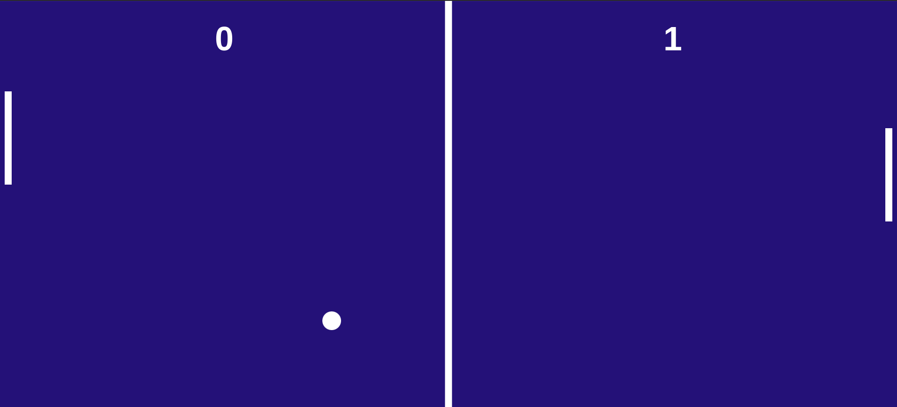

<h1 align="center"> PING PONG </h1>

Projeto de um jogo de PING PONG feito nas aulas do curso DEV SAMURAI.  

 

  

## 🚀 Tecnologias

Esse projeto foi desenvolvido com as seguintes tecnologias:

- Canvas
- JavaScript
- Git e Github

## 💻 Projeto

Este Projeto é um Game de Ping Pong.

- [Acesse o projeto finalizado, online](https://gabrielhidan.github.io/Ping-Pong/)